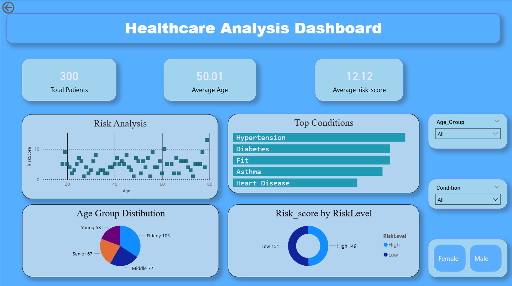

# Healthcare Analytics Dashboard

## Project Overview

This project analyzes patient healthcare data to identify patterns in risk levels, age distribution, and medical conditions.
Python was used for data cleaning and exploratory data analysis, and Power BI was used to create an interactive dashboard.

---

## Objectives

* Analyze patient demographics and health metrics
* Identify high-risk patient groups
* Visualize top medical conditions
* Build an interactive healthcare dashboard

---

## Tools & Technologies

* Python (pandas, numpy, matplotlib, seaborn)
* Power BI
* Git & GitHub

---

## Dataset Columns

* PatientID
* Age
* Gender
* BMI
* BloodPressure
* Condition
* RiskScore
* HighRisk
* AgeGroup
* RiskLevel

---

## Dashboard Features

* KPI Cards:

  * Total Patients
  * Average Age
  * Average Risk Score
* Risk vs Age Scatter Plot
* Top Conditions Bar Chart
* Age Group Pie Chart
* Interactive Filters

## Dashboard Preview



---

## Project Structure

```
healthcare-analytics/
│
├── healthcare_dataset.csv
├── cleaned_healthcare_data.csv
├── healthcare_analysis.ipynb
├── healthcare_dashboard.pbix
└── README.md
```

---

## How to Run

### Python

```
pip install pandas numpy matplotlib seaborn
```

Open:

```
healthcare_analysis.ipynb
```

### Power BI

Open:

```
healthcare_dashboard.pbix
```

---

## Future Improvements

* Use real-world healthcare dataset
* Add predictive risk modeling
* Deploy dashboard online

---

## Author

Rayan Singh
GitHub: https://github.com/rayansingh955
